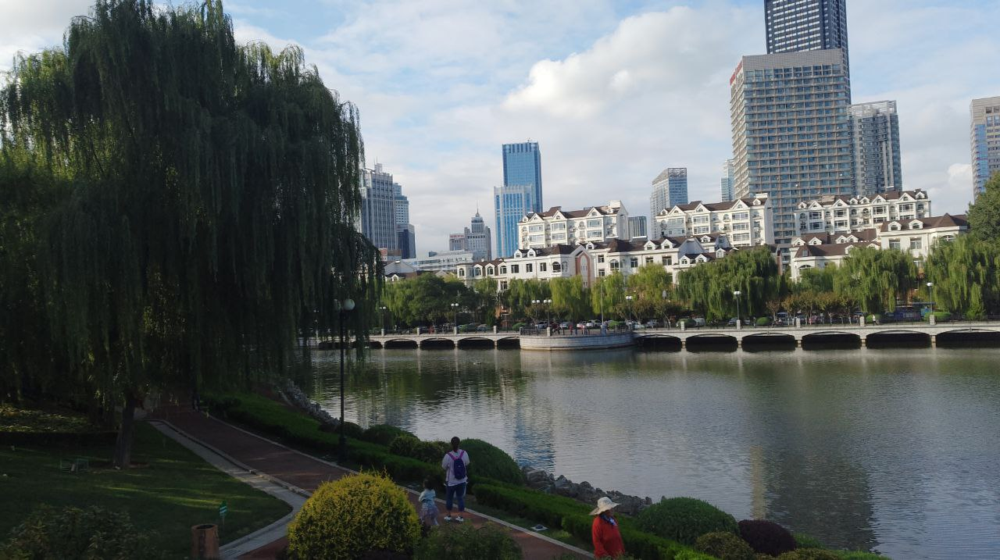
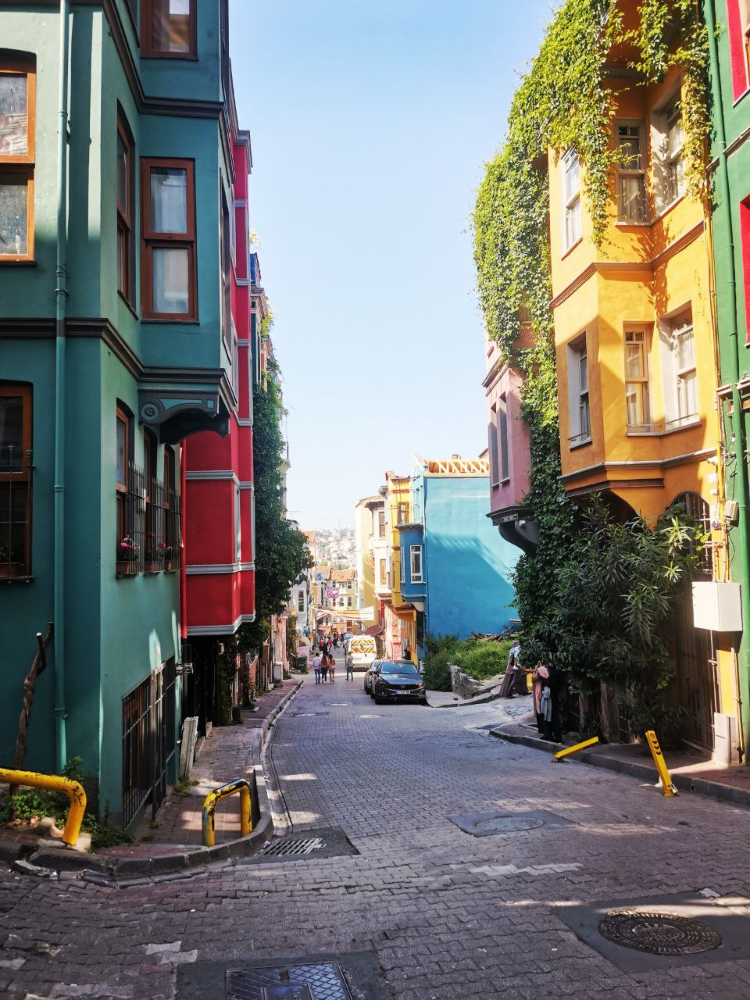
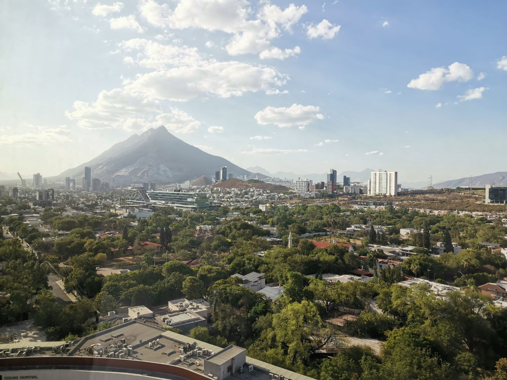

## Здравствуйте!

***Меня зовут Алина.***

_Мне 30 лет. За свою жизнь, я сумела пожить в нескольких странах:_
* С августа 2016 года по август 2019 года я жила в Китае, город Далянь;
* С мая 2023 года по июль 2023 года я жила в Турции, город Стамбул;
* С августа 2023 года по данный момент я проживаю в Мексике, город Монтеррей.

---

**В связи с тем, что я хотела бы совмещать длительные путешествия и работу, я решила найти профессию, которая позволит мне работать удаленно с любой точки мира.**

Поэтому я решила изучать профессию Python-разработчик в [Нетологии](https://netology.ru)

